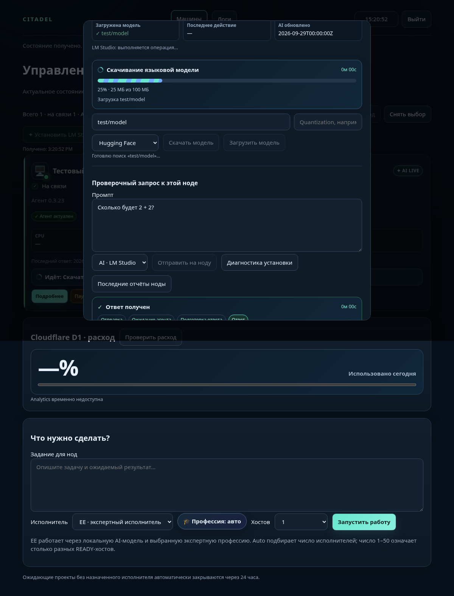

# Индикаторы хаба и агент 0.3.23

Основная страница сайта собирается из `operations.html`; прежняя отдельная
страница `hub.html` использует тот же набор состояний индикатора.

| Операция | Что показывает хаб |
| --- | --- |
| Установка / обновление LM Studio | Отправка → ожидание агента → скачивание установщика → установка → проверка → запуск → готово |
| Скачивание языковой модели | Скачанные МБ, общий размер и процент, если агент сообщил размер |
| Неизвестный размер скачивания | Анимированная полоса без выдуманного процента |
| Загрузка модели в память | Этап загрузки и завершение |
| Промпт | Отправка → ожидание агента → подготовка → поступающий ответ → ответ получен |
| Ошибка / отмена | Конкретное сообщение, остановленная анимация, доступная повторная отправка |
| Сбой получения статуса | Сообщение о потере связи и повторная проверка без повторного запуска команды |

При установке число этапов обозначается как «шаг 2 из 5», а не как процент
скачивания. Учитывается системное предпочтение уменьшенной анимации.

Команды связаны с телеметрией через `operation_id`, запросы — через `query_id`.
Ответ от прежнего запроса не завершает новый. Повторная отправка во время
активной операции заблокирована. Закрытие панели и скрытая вкладка
приостанавливают опрос; открытие панели восстанавливает отслеживание.

Агент поддерживает heartbeat во время долгих операций. Controller сохраняет
принятую LM-команду при свежей связанной телеметрии, максимум два часа;
скачивание ограничено одним часом. STOP/SERVICE_STOP проверяется между
опросами скачивания и прерывает активный поток ответа. Поток без `chat.end`
помечается ошибкой, сохраняя уже полученную часть ответа.



Снимок браузерной проверки с синтетическими данными: скачано 25 МБ из 100 МБ.

## Проверка

```bash
scripts/validate.sh
npm run build
npm run check:cloudflare
python tests/lmstudio-progress.py
```

Браузерная проверка использует синтетические ответы Controller. Она охватывает
основную и прежнюю страницы хаба, реальный DOM и Chromium, отправку,
устаревший ответ, получение ответа, прогресс в байтах, этапы установки,
ошибки и восстановление связи, повторное открытие панели, мобильный экран
390 px, неудачную отправку задания и выход.

```bash
python -m pip install playwright
python -m playwright install chromium
python tests/progress-browser.py
```

Скрипт использует системный `chromium`, если он доступен; путь можно задать
через `CITADEL_TEST_CHROMIUM`. Иначе используется браузер Playwright.
Протокольные проверки и проверка содержимого пакета не заменяют запуск на
физическом Windows-компьютере с установленной LM Studio.

## Публикация

Обновлять нужно и сайт / Worker, и агент. После объединения PR источники и
SHA-256 новой версии будут доступны в `main`. Существующий workflow сборки
создаёт установочные пакеты из этих источников. Пакеты собираются командами:

```bash
python scripts/build_fixed_agent_package.py
python scripts/build_fixed_linux_agent_package.py
```

Старые Windows one-click установки с правами RX для LocalService требуют
локального установщика / отдельного механизма обслуживания для self-update
и rollback. Этот PR не расширяет права службы. Внешняя пользовательская
установка LM Studio не удаляется командой удаления managed runtime.
